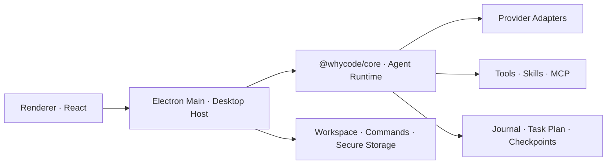

# WhyCode

> **Alpha · Active development**
>
> 核心 Agent 工作流已经可用，但界面、协议和配置仍在持续演进，当前版本不建议直接用于生产环境。

WhyCode 是一款 Windows 优先的通用桌面 AI Agent，基于 Electron、React 与 TypeScript 构建。它尤其擅长代码编写、代码理解和调试，也支持文档处理、调研、规划与知识问答。

项目的核心方向不是绑定单一模型，而是提供一个可恢复、可审批、可扩展的桌面 Agent Harness。

## 核心特点

- **多 Agent 协商**：Main / B / C 独立分析、互相投票，在达成规则性共识后由 Main 执行。
- **多模型接入**：支持 OpenAI、Anthropic、Google Gemini、DeepSeek、智谱和小米 MiMo，并提供独立的 CLIProxyAPI 连接。
- **持久长任务**：任务计划、后台命令和完成通知均由宿主持久管理，后台任务结束后可自动唤醒所属 Agent。
- **权限与恢复**：提供分级权限、精确路径审批、文件检查点、冲突检测和按轮回滚。
- **隔离工作区**：支持受管默认目录、Local 项目和 Git Worktree，避免多个任务相互污染。
- **可扩展工具**：内置 Skills、MCP 延迟工具发现、网页搜索与读取、图片/PDF 输入及 Office 文档工作流。
- **会话可恢复**：使用 append-only JSONL 保存稳定事件，在进程中断、窗口重载和应用重启后恢复可见历史与任务状态。

## 架构概览



- `packages/core`：模型无关的 Agent 循环、协商、工具契约、权限、任务和持久化语义。
- `apps/desktop/src/main`：Electron 宿主、系统能力、会话运行体和安全边界。
- `apps/desktop/src/renderer`：桌面界面与 CoreEvent 的可恢复投影。

## 本地运行

### 环境要求

- Windows 10/11
- Node.js 22.18 或更高版本
- pnpm 11.9

### 启动开发环境

```bash
git clone <repository-url>
cd WhyCode
corepack enable
pnpm install
pnpm dev
```

首次使用时，在应用设置中配置希望使用的模型连接。密钥由桌面宿主通过系统安全存储管理，不应写入仓库。

## 常用命令

```bash
pnpm test
pnpm typecheck
pnpm build
pnpm audit --prod
```

## 当前阶段

WhyCode 目前处于 Alpha 阶段。核心工具循环、多 Agent 协商、权限审批、持久会话、Worktree、后台任务、Skills、MCP 和多模态输入已经形成可运行链路；安装体验、发行打包、公开文档和更多真实场景回归仍在完善。

问题报告请尽量包含复现步骤、预期行为、实际行为、模型连接类型以及脱敏后的相关日志。请勿提交 API Key、访问令牌、个人路径或包含隐私的会话数据。

## 参与贡献

提交改动前请阅读 [CONTRIBUTING.md](CONTRIBUTING.md)。

## License

[MIT](LICENSE)
